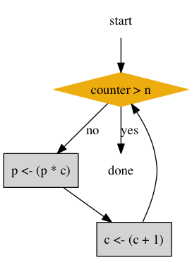

References
===
[Structure and Interpretation of Computer Programs 2/E](http://www.amazon.com/Structure-Interpretation-Computer-Programs-Engineering/dp/0262510871/ref=sr_1_1?ie=UTF8&qid=1452264667&sr=8-1&keywords=Structure+and+Interpretation+of+Computer+Programs)

[컴퓨터 프로그램의 구조와 해석](http://www.kyobobook.co.kr/product/detailViewKor.laf?ejkGb=KOR&mallGb=KOR&barcode=9788991268326&orderClick=LAG&Kc=)

Documents
===
__Korean__
- [Chapter 1](sicp/chap-1.ipynb)
- [Chapter 2( ~2.29 )](sicp/chap-2.ipynb)
- [Old Documents](backup/notebook)

__English__
- [Chapter 1](sicp/chap-1-en.ipynb)

Works
===
__Documentation__
This project has the documentation of SICP contents using [iPython notebook](http://ipython.org/notebook.html).
For this, It uses Scheme, Python, Haskell.

__Test__
The project uses [Chicken Scheme test](http://wiki.call-cc.org/eggref/4/test) for testing.

__Graph__
This project uses [graphviz](http://www.graphviz.org/) to visualize graphs like register machine in chapter 5.

Tools
===
__Editor__
[Mit-scheme](https://www.gnu.org/software/mit-scheme/) ( But at the beginning, [Racket](http://www.racket-lang.org/) was used )

__Kernels__ For scheme kernel & haskell
__[calysto_scheme](https://github.com/Calysto/calysto_scheme)__
It can be downloaded using pip
`$ pip3 install --upgrade calysto-scheme`

__[IHaskell](https://github.com/gibiansky/IHaskell)__
It can be downloaded in a variety of ways, but The project used ['cabal'](https://www.haskell.org/cabal/)
`$ cabal install ihaskell --reorder-goals`
